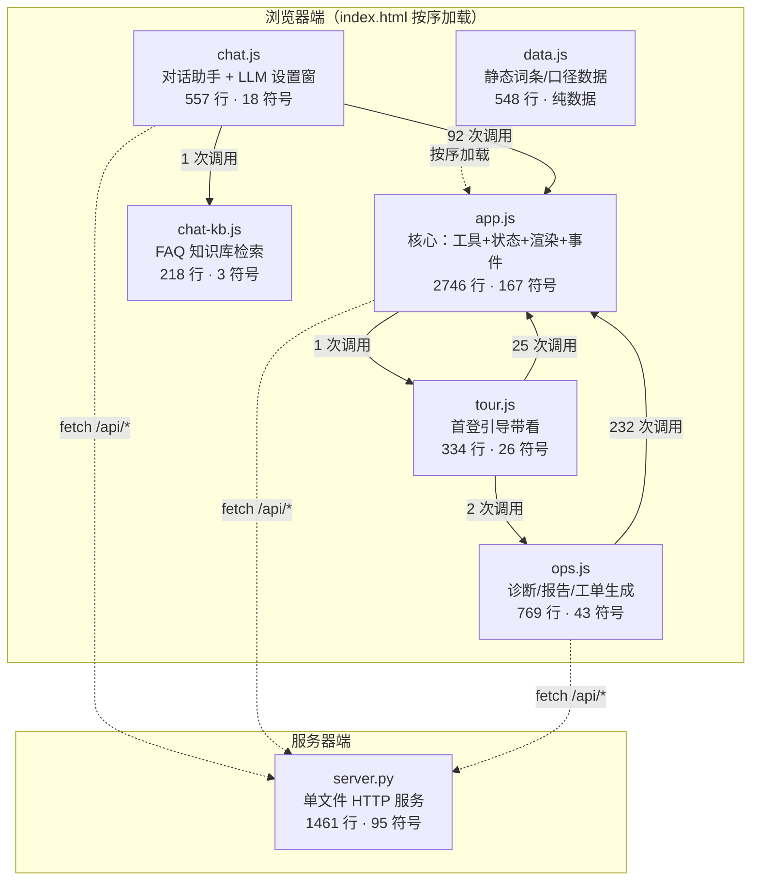
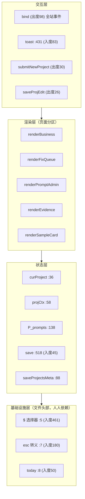
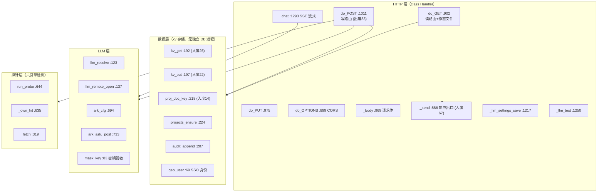
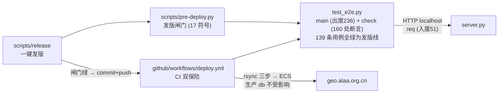

# SKIPGEO 代码图谱

> 生成方式：codegraph CLI 建索引（`.codegraph/codegraph.db`，SQLite，已 gitignore），本文档从索引数据提取。
> 索引时间：2026-09-07（基于生产版本 0.2.0 代码，`git main @ 1f97480`）。
> 刷新方法：`~/.nvm/versions/node/v24.18.0/bin/codegraph sync .`（改动自动同步由索引守护进程负责；agent/ 目录被 .gitignore 忽略，不入图谱）。

## 1. 总览

| 指标 | 数值 |
|---|---|
| 索引文件 | 11 个（JS 6 / Python 4 / YAML 1） |
| 节点 | 407（function 241、variable 65、constant 40、import 38、method 11、file 10、class 2） |
| 边 | 2,515（calls 1,874、contains 397、references 236、imports 8） |
| 代码量 | 约 7,500 行（不含测试为 6,700 行） |

核心事实：**全系统没有一个包管理器依赖**——前端零框架（原生 JS + 全局函数共享），后端零第三方库（Python 标准库 http.server + urllib）。所有模块间关系都是"跨文件全局函数调用"，这是图谱边的主要构成。

## 2. 模块依赖图（浏览器端实测调用边）

`index.html:768-787` 按序加载：data.js → app.js → ops.js → tour.js →（内联）→ chat-kb.js → chat.js。app.js 先加载、定义全局工具，后加载的文件反向依赖它。



依赖解读：

- **app.js 是前端枢纽**：接收 ops.js（232）、chat.js（92）、tour.js（25）共约 350 次跨文件调用，提供 `$/esc/$$/today/toast/save` 等全局基础函数。改 app.js 头部工具函数 = 全站回归。
- **ops.js 只出不进**（除 tour.js 2 次）：诊断渲染/报告生成的叶子模块，是安全的重构隔离区。
- **chat.js 自成一体**：通过 `inject`（出度 85）把助手 UI/逻辑注入宿主页面，仅回呼 app.js 工具与 chat-kb.js 检索。
- **data.js 零出边**：纯静态数据，改动无扩散风险。
- Python 侧零相互 import：server.py / test_e2e.py / real_run.py / pre-deploy.py 各自独立，只 import 标准库（urllib / http.server）。

## 3. 枢纽节点（改这些函数前先看影响面）

入度最高（被调用最多）：

| 函数 | 文件:行 | 入度 | 角色 |
|---|---|---|---|
| `$` | app.js:5 | 461 | `document.querySelector` 别名，全站 DOM 入口 |
| `esc` | app.js:7 | 180 | HTML 转义，防注入守门员 |
| `check` | test_e2e.py | 159 | e2e 断言原语（139 条用例的基座） |
| `toast` | app.js:431 | 83 | 全局提示 |
| `Handler::_send` | server.py:886 | 67 | 所有 HTTP 响应唯一出口 |
| `$$` | app.js:6 | 55 | `querySelectorAll` 别名 |
| `req` | test_e2e.py | 51 | e2e HTTP 客户端 |
| `today` | app.js:8 | 50 | 日期格式化 |
| `save` | app.js:518 | 45 | 前端状态持久化（localStorage） |
| `curProject` | app.js:36 | 34 | 当前项目上下文（读） |

出度最高（扇出最大的调度中枢）：

| 函数 | 文件:行 | 出度 | 角色 |
|---|---|---|---|
| `main` | test_e2e.py | 236 | e2e 总调度 |
| `bind` | app.js | 98 | 全站事件绑定 |
| `inject` | chat.js | 85 | 对话助手装配器 |
| `Handler::do_POST` | server.py:1011 | 83 | 写接口路由中枢 |
| `opsBuildToolkit` | ops.js | 40 | 诊断工具箱组装 |
| `Handler::do_GET` | server.py:902 | 31 | 读接口路由 + 静态文件 |
| `renderPromptAdmin` / `renderEvidence` / `renderDiagResult` | app.js / ops.js | 24-33 | 各渲染分区 |

## 4. app.js 内部分层（167 符号，2746 行）



## 5. server.py 结构（1461 行，95 符号）



要点：

- **`_send` 是唯一响应出口**（入度 67）：加响应头/缓存策略只改一处。
- **数据层全部走 kv_get/kv_put**（生产数据在 `/var/lib/geo-control`，rsync 发版不影响）。
- **LLM 双轨**：`llm_resolve` 按账号配置分流到个人 LLM（`llm_remote_open`）或火山 Ark（`ark_cfg`/`ark_ask`，Responses API web_search 联网）。
- **探针层**：`run_probe` 驱动六引擎 GEO 检测，`_own_hit` 判定自家资产命中。

## 6. 测试与发版链路



- e2e 是唯一防线：SPA 串值类缺陷靠 `?spacheck=1` 金标准通道（详见 test_e2e.py）。
- 本地闸门 + CI 双保险，全绿才允许 push（2026-09-06 装设）。

## 7. 其余文件

| 文件 | 行数 | 符号 | 角色 |
|---|---|---|---|
| system/real_run.py | 82 | 17 | 探针独立跑批脚本（不依赖 server） |
| scripts/pre-deploy.py | 59 | 17 | 发版前闸门（调 e2e） |
| .github/workflows/deploy.yml | — | 0 | CI：e2e 双保险 + 自动部署 |
| system/js/data.js | 548 | 2 | 纯静态数据（词条/口径），零调用边 |

## 8. 图谱查询速查

```bash
CG=~/.nvm/versions/node/v24.18.0/bin/codegraph
$CG sync .                                   # 增量同步索引
$CG status .                                 # 索引统计
$CG query "<符号名>"                          # 搜符号
$CG node "renderDiagResult"                  # 源码 + 调用者/被调用者链
$CG callers "esc"                            # 谁调它
$CG impact "Handler::_send"                  # 改它影响什么
$CG explore "SSO 身份认证"                    # 语义探索一个领域
sqlite3 .codegraph/codegraph.db "..."        # 直接查图谱数据
```

MCP 方式：codegraph 已注册为 MCP server（`codegraph_explore` / `codegraph_node` 工具）。
